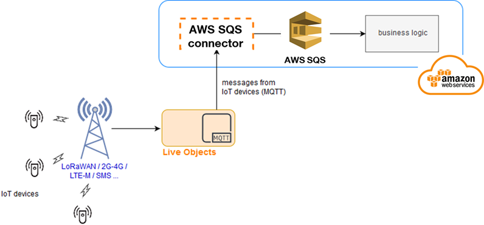
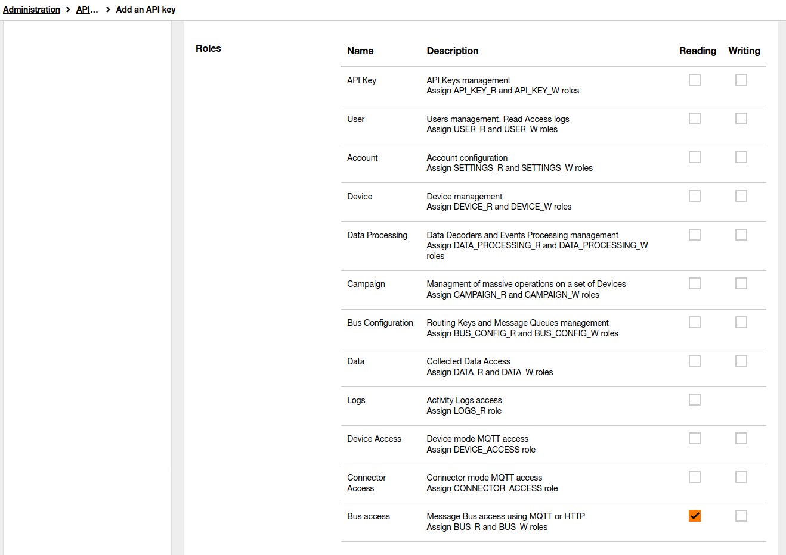
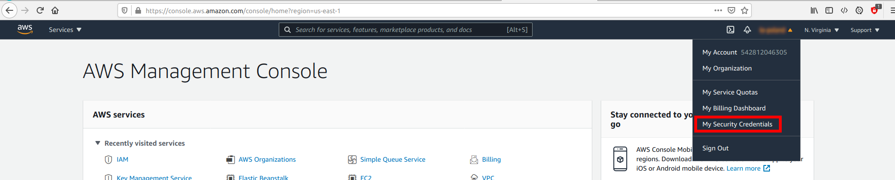
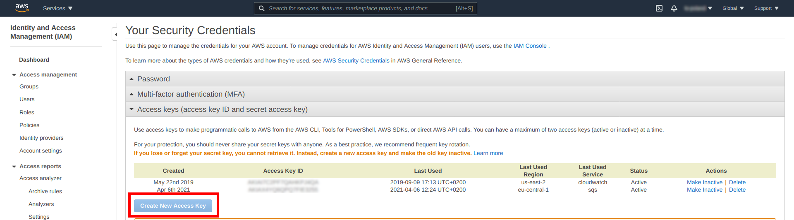
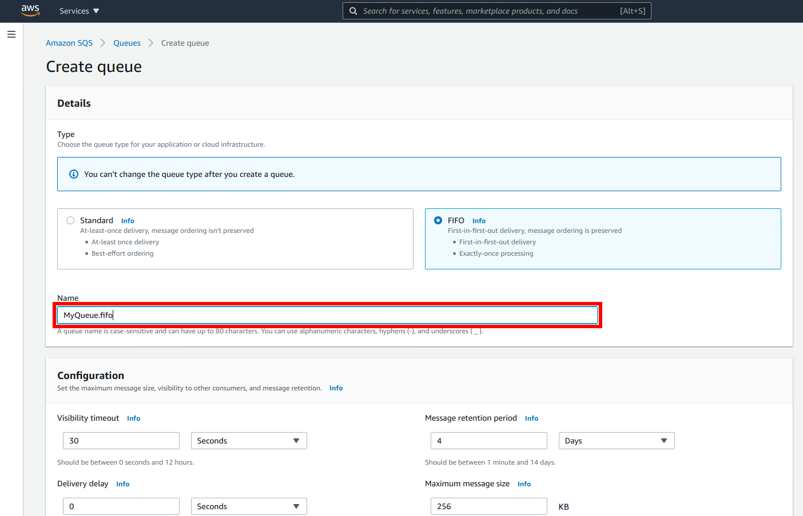
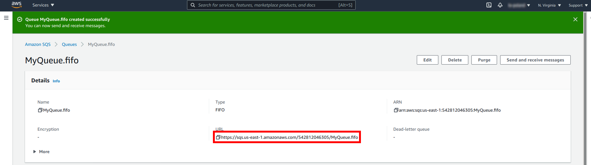
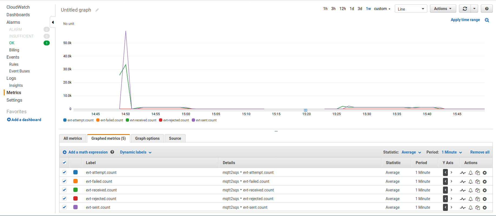
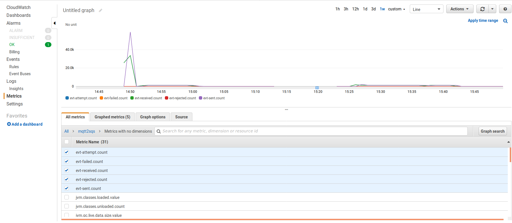

# Mqtt2SQS

## Table of contents
* [Introduction](#introduction)
* [Connector](#connector)
  * [Performance and scalability](#performance-and-scalability)
* [Technologies](#technologies)
* [Requirements](#requirements)
* [Building and installation](#building-and-installation)
* [Configuration](#configuration)
  * [Live objects side](#live-objects-side)
    * [Generate Live Objects API key](#generate-live-objects-api-key)
  * [AWS Side](#aws-side)
    * [Create AWS Access key](#create-aws-access-key)
    * [Use AWS Access keys](#use-aws-access-keys)
    * [Create AWS SQS queue](#create-aws-sqs-queue)
  * [Connector side](#connector-side)
    * [Application](#application)
    * [Logging](#logging)
* [Launching](#launching)
  * [Launching on local machine](#launching-on-local-machine)
  * [Installation on AWS machine](#installation-on-aws-machine)
    * [App deployment](#app-deployment)
  * [Start receiving messages](#start-receiving-messages)
  * [Metrics](#metrics)
  * [Health Check](#health-check)

## Introduction

This project contains connector 'Live Objects MQTT to AWS Simple Queue Service (SQS)' and was designed to read events from Live Objects MQTT and pushing them to AWS Simple Queue Service (SQS).  


This project is intended for Live Objects users wishing to explore integration patterns with AWS and for organizations already running business logic on AWS planning to work on events from IoT devices sourced via Live Objects.


## Connector

The connector (Mqtt2Sqs) subscribes to selected Live Objects MQTT queue, reads all events and publishes them to selected AWS SQS without any modification to events’ contents. It is intended to be run as a long-running process hosted on AWS. Connector code is written in Java, using the Spring Boot framework.

Mqtt2Sqs supports only the communication from Live Objects i.e. it reads messages send from IoT devices. Communication towards devices (sending commands to devices) is not supported.

Provisioning of IoT devices is within the scope of Live Objects; Mqtt2Sqs has no knowledge on what devices are communicating; it is just transparently moving messages from Live Objects to AWS SQS. It is assumed that business logic acting on those messages is to be applied by applications consuming the messages from SQS.



### Performance and scalability

The software acts as an integration demonstrator. Mqtt2Sqs comes without any guarantees related to percentage of messages successfully written to SQS, nor to the response time. Moreover, the ordering of messages is not guaranteed to be preserved; the application uses thread pools to run its MQTT and Event Hub adapters which may cause some messages to arrive in SQS out of order in which they were kept within Live Objects’ MQTT queue.

Tested on AWS, the connector was processing events at the rate of ~60,000 messages per minute. This should not be treated as a guarantee either, since the throughput depends i.a. on message size and number of applications shared within SQS.

Live Objects platform supports load balancing between multiple MQTT subscribers. It is possible to run multiple instances of Mqtt2SQS, each of them will handle its own subset of messages.

## Technologies
* Java 8
* Spring Boot 2.3.2


## Requirements
In order to run the connector you need to have:
* **Live Objects account**
  * API key which can access the queue
  * MQTT fifo queue (both MQTT fifo queue and API key generation is described in the [user guide](https://liveobjects.orange-business.com/#/cms/ressources-guide-utilisateur/))
* **AWS account** 
  * Access keys (access key ID and secret access key) to AWS Management Console (see the [documentation](https://docs.aws.amazon.com/organizations/latest/userguide/orgs_manage_accounts_create.html))
  * SQS set up (creation process is described in official [documentation](https://docs.aws.amazon.com/AWSSimpleQueueService/latest/SQSDeveloperGuide/sqs-setting-up.html))
  
* **Development tools**
   * Java and supporting IDE (e.g. IntelliJ, Eclipse)
   * Apache Maven

## Building and installation
In order to create an installation package, run the command:
```
mvn clean package -Prelease
```
After running this command, the file  `mqtt2sqs-[VERSION].zip` will be created in the target directory. This file should be placed where the connector will be started, and then unpacked. You can deploy this connector wherever you want (local server, cloud provider etc.).

After unpacking the archive, you should get a structure similar to this:
```
bin/
conf/
data/
lib/
```

## Configuration

To start synchronization between Live Objects and AWS SQS, you need to configure Live Objects API key, Live Objects FIFO queue and AWS SQS queue URL in the `application.yaml` file.

The AWS Access keys will be configured in application host environment later.


### Live objects side

#### Generate Live Objects API key
Login to Live Objects Web Portal and go to **Administration** -> **API keys**  
  

Click **Add** button and fill fields.  


To  validate  the  creation  of  the  key,  click  on  the **Create** button.  Your  key  is  generated  in  the form of an alphanumeric sequence and a QR code.


### AWS Side

#### Create AWS Access key
Login to AWS Console, click on user name on top bar and select **My Security Credentials**.



Expand **Access keys (access key ID and secret access key)** and click **Create New Access Key**




#### Use AWS Access keys
Created AWS Access key (access key id and secret access key) place in file **~/.aws/config** on machine where connector will be runned:

```
[default]
aws_access_key_id = 
aws_secret_access_key = 
```  

#### Create AWS SQS queue

In order to receive messages from Live Objects AWS Simple Queue Service (SQS) must be defined.

In AWS Console select **Services** -> **Application Integration** -> **Simple Queue Service**, and next click **Create queue** button.

Next, please define **Type** and insert **Name** of Queue:



And click button **Create queue**.

After queue was created URL can be copied for further use in `application.yaml`.



### Connector side
#### Application
Configuration can be found in **application.yaml** file located in `conf/` directory.
```
1     lo:
2       hostname: liveobjects.orange-business.com
3       api-key:
4       topic:
5       synchronization-interval: 60000
6       message-qos: 1
7       mqtt-persistence-dir: ${basedir:.}/temp/
8       keep-alive-interval-seconds: 30
9       connection-timeout: 30000
10      message-batch-size: 10
11     
12    aws:
13      sqs:
14        queue-url:
15        thread-pool-size: 40
16        connection-timeout: 5000
17        task-queue-size: 150000
18        throttling-delay: 5000
19        max-send-attempts: 3
20        message-group-id: messagegroup1
21        region: eu-central-1
22        keep-alive-time: 10
23    
24    cloud:
25      aws:
26        stack:
27          auto: false
```
You can change all values but the most important lines are:


**2** - Live Objects hostname  
**3** - Live Objects API key with at least BUS_R role  
**4** - Name of the Live Objects MQTT queue  
**14** - URL of your AWS SQS queue  
**21** - Region where the SQS is placed  

#### Logging
Logging configuration can be found in **logback.xml** file located in `conf/` directory. You can find more information about how to configure your logs [here](http://logback.qos.ch/manual/configuration.html)


## Launching
In order to run the connector, use the `app.sh` file for linux or `app.bat` if you are using windows. These files are located in the `bin/` directory.

### Launching on local machine
Connector is prepared for running on AWS machine. To start application on local environment, it's necessary to add extra configuration in **application.yml**, for example:

```
cloud:
  aws:
    region:
      static: eu-central-1
```

### Installation on AWS machine

In order to be deployed to AWS, the project uses Elastic Beanstalk. The installation is described on the following tutorial: [documentation](https://docs.aws.amazon.com/elasticbeanstalk/latest/dg/GettingStarted.html)

#### App deployment

Deployment to AWS is performed by the Elastic Beanstalk. Its deployment is described in [documentation](https://docs.aws.amazon.com/elasticbeanstalk/latest/dg/create_deploy_Java.html).

### Start receiving messages
After starting the application it's necessary to go `http://localhost:8080/run` or similar address associated with virtual machine in order to start receiving messages. After this action connector will start fetching messages from Live Objects Queue and put them into AWS SQS queue.


### Metrics
Application sends its metrics to Cloud Watch Metrics every 1 minute. There are number of available metrics e.g. amount of received, sent and failured messages. You can watch them all in Amazon Cloud Watch console under "Metrics" in namespace - mqtt2sqs.





### Health Check
You can configure Alarm to notify when something goes wrong with your environment. Details can be found [here](https://docs.aws.amazon.com/elasticbeanstalk/latest/dg/using-features.alarms.html)   
